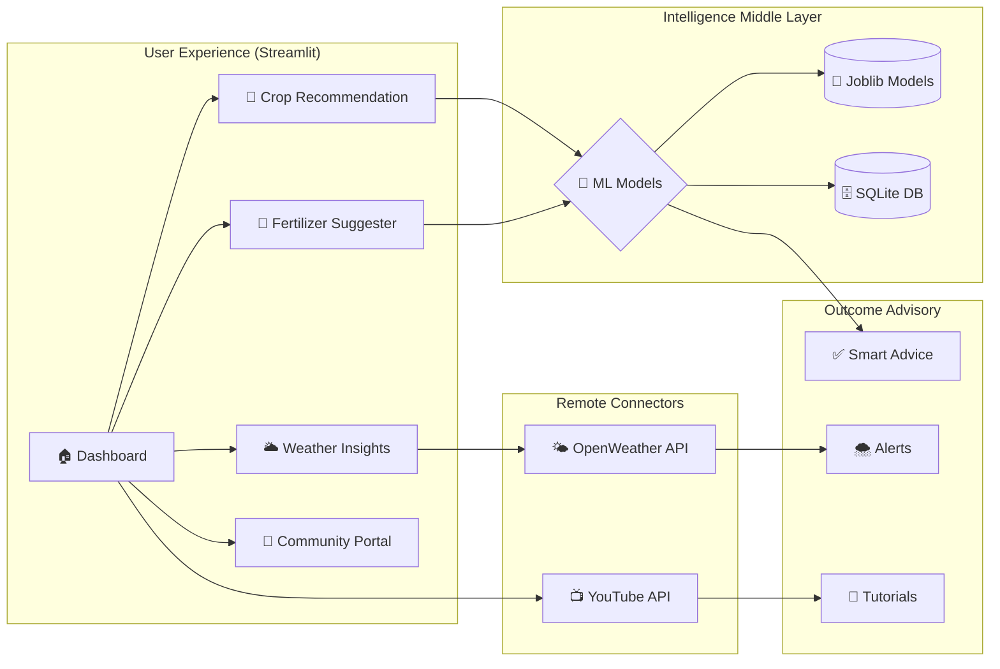
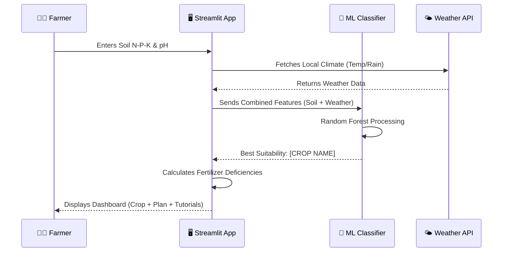
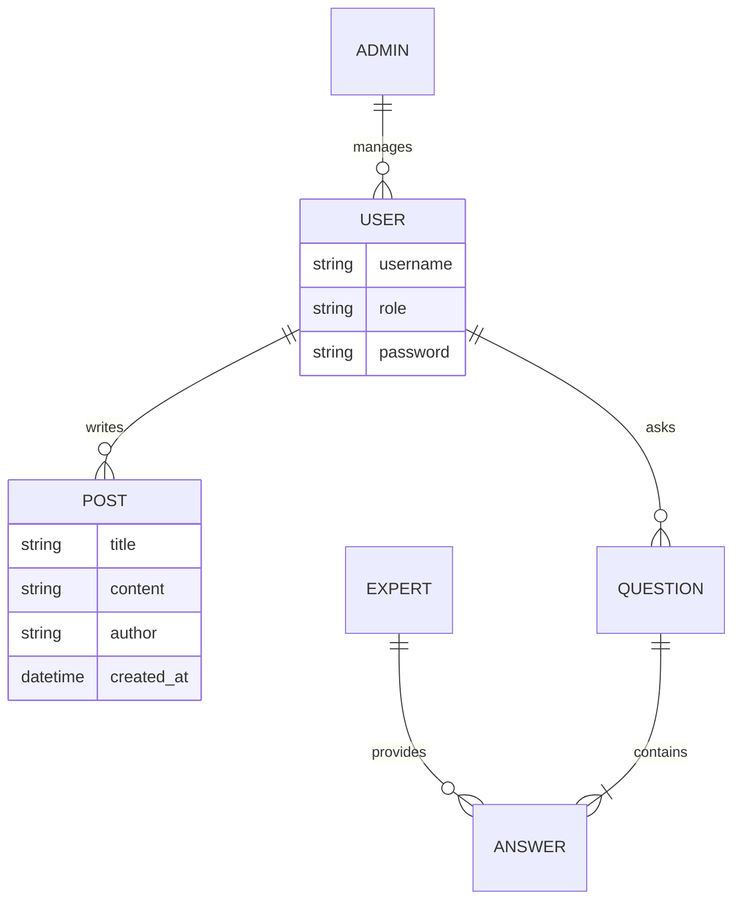

# 📊 Comprehensive System Diagrams

This document contains professional diagrams for your **Climate-Aware Crop & Organic Fertilizer Recommendation System**.

## 1. 🖼️ High-Level System Concept
A futuristic visual representation of how your AI connects the farmer with the land.

---

## 2. 🧱 Functional Block Diagram
This shows the logical flow of data between the different modules of your application.

---

## 3. 🔄 User Journey Sequence Diagram
This shows how the system processes a single crop recommendation request.

---

## 4. 🗃️ Data Schema Relationship
This explains how your Community database connects the different user roles.

---

### 📂 Accessing these Diagrams:
*   **Mermaid Code:** [ARCHITECTURE_DIAGRAM.md](file:///c:/Users/sw/Desktop/climate_aware_final_project/ARCHITECTURE_DIAGRAM.md)
*   **Interactive View:** [architecture_diagram.html](file:///c:/Users/sw/Desktop/climate_aware_final_project/architecture_diagram.html)
